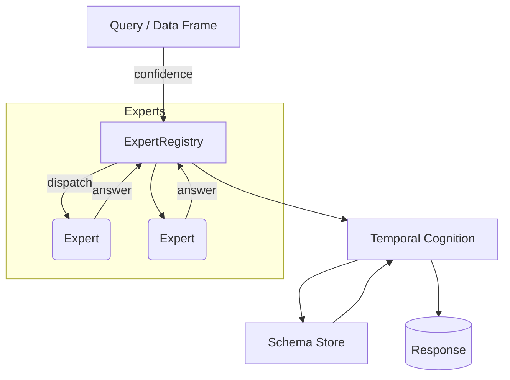

# Atlan Wave-Engine Architecture

This document provides a high-level overview of the Wave-Engine stack as of v0.1-alpha (July 2025).

---

## 1. Core Concepts

| Concept | Purpose | File(s) |
|---------|---------|---------|
| **Wave Encoding** | Each symbolic concept (logic operator, acoustic feature, pixel pattern …) is mapped to a stable frequency.  Reasoning emerges from constructive / destructive interference. | `src/temporal_cognition.py` |
| **Schema** | A persisted resonance pattern that recurs across experiences.  Stored deterministically in JSON / SQLite. | `src/schemas.py`, `src/schema_store.py` |
| **Dream-Replay** | Off-line reinforcement cycle: top-N schemas are replayed back into the engine to consolidate memory. | `src/temporal_cognition.py` |
| **Expert Module** | Drop-in Python class that knows how to: `can_handle(query)` → confidence, `process_query()` → `ExpertResponse`. | `expert_modules/base_expert.py` |
| **Expert Registry** | Runtime broker that scores all experts and dispatches the query to the top candidate(s). | `expert_modules/registry.py` |

---

## 2. Data Flow



1. External code submits a `query` dict (natural language or structured).  
2. `ExpertRegistry` asks each registered expert for a confidence score.  
3. Top-ranked expert(s) process and return an `ExpertResponse`.  
4. The response is converted into wave events and fed into `TemporalCognitionEngine`.  
5. Recurrent resonance patterns become **schemas** and are saved via `JsonSchemaStore` / `SQLiteSchemaStore`.  
6. The final answer + reasoning bubble back to the caller.

---

## 3. Current Expert Packs

| Domain | Key Experts | Benchmarks |
|--------|-------------|-----------|
| Logic | `LogicExpertModule` | LogicBench 2 020 Q → 70–79 % @ <3 s |
| Vision | `PixelPrototypeDigitExpert`, `PCAPrototypeDigitExpert`, `DCTDigitExpert` | MNIST 10 k → 93–96.7 % (0.5–1 ms / sample) |
| Acoustic | `downward_sweep_expert`, `freq_sweep_expert`, `pulse_repeat_expert` | Dolphin WAV peak picking demo |
| EEG | `RhythmPowerExpert`, `MuDropExpert` | Synthetic μ-suppression detection |

Experts are **100 % plug-and-play**: drop a new file in `expert_modules/`, register it, and it’s live.

---

## 4. Persistence & Determinism

* Schemas are flushed to `schemas_*.json` every N events or via `SQLiteSchemaStore` for production.  
* `CogConfig` controls thresholds, deterministic seeds, and persistence backend → reproducible runs.

---

## 5. Extending the Engine

```python
from expert_modules.base_expert import BaseExpertModule, ExpertResponse

class MyExpert(BaseExpertModule):
    def __init__(self):
        super().__init__("MyExpert", domain="finance", version="0.1")

    def can_handle(self, query, ctx=None):
        return 0.8 if "stock" in str(query).lower() else 0.0

    def process_query(self, query, ctx=None):
        price = lookup_price(query["ticker"])
        return ExpertResponse(confidence=0.9, answer=price)
```
`ExpertRegistry().register_expert(MyExpert())` —> the system now answers finance questions.

No changes to core or other modules required.

---

## 6. Roadmap

* **v0.2** – CI badges green, ≥60 % test coverage, YAML config loader.  
* **v0.3** – Real-time streaming interface (WebSocket) + Grafana dashboard.  
* **v1.0** – FedRAMP-ready edge appliance + signed schema sync protocol.

Contributions welcome via pull-requests (see `CONTRIBUTING.md`). 